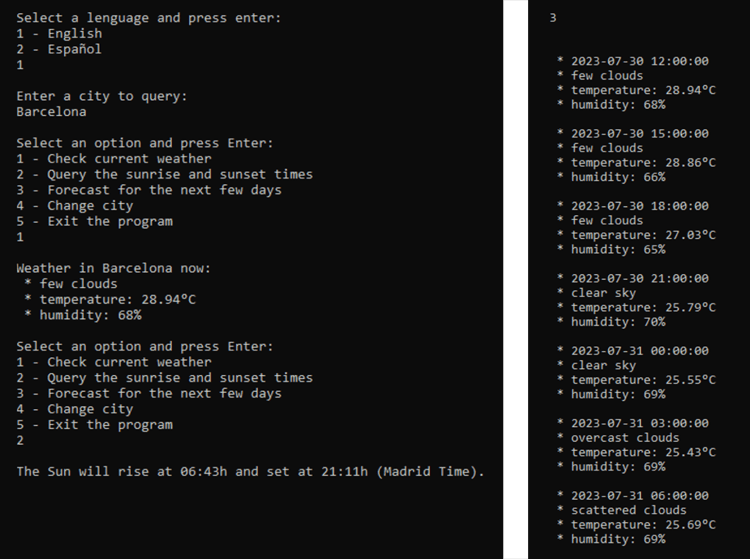

# How is the weather? ☀

A small Python app that allows you to check the weather forecast for your city and other data such as sunrise and sunset times using the OpenWeatherMap API.

## Table of Contents
1. [Getting Started](#gettin-started)  
1.1. [Prerequisites](#prerequisites)
2. [Deployment](#deployment)
3. [How to run the program](#how-to-run-the-program)
4. [Next steps](#next-steps)  
4.1 [Database and Docker](#database-and-docker)  
4.2 [Adding a Language](#adding-a-language)
5. [Built with](#built-with)
6. [Autor](#autor)
7. [License](#license)


<a name="gettin-started"></a>
## 1 - Getting Started 🚀

Follow these instructions to run the program smoothly on your computer
<a name="prerequisites"></a>
### 1.1 - Prerequisites  📋

🐍 **Python**

Python is the programming language with which the entire application is built.

You can download Python from its official website: https://www.python.org/downloads/

For the proper functioning of this program, you need to have some additional Python libraries installed:

📚 **request**

To make requests to the OpenWeatherMap API. To install it:

```
pip install requests
```

📚 **pytz**

To manage time zones. To install it:

```
pip install pytz
```

🔑 **API key** 

You will also need a personal API key for the OpenWeatherMap API. You can obtain it for free by registering at https://openweathermap.org/.
Once registered, an API key will be assigned to you automatically. You can check your API keys at https://home.openweathermap.org/api_keys. If you want another key, you can generate it without any issues and for free. Remember that this public API has its daily limitations, but for a use like that of this program, it is more than sufficient. If your key gives you problems, consider that it may take a few hours to activate.
<a name="deployment"></a>
## 2 - Deployment 🔧

To obtain and run this project:

**Clone** this repository using

```
git clone https://github.com/0xTrivi/how-is-the-weather.git
```

Alternatively, download the Zip from the Code tab. It doesn't matter the destination directory.

Once you have obtained the project, you need to configure the personal API Key obtained from OpenWeatherMap. Open the `api_config.py` file located in the root of the project, and replace the value of `yourAPIKey` with your own key.

```python
api_key = "yourAPIKey" # replace
url = "http://api.openweathermap.org/data/2.5/forecast"
```

The variable `url` is the address that the OpenWeatherMap documentation also provides to make the API call. If you want to change the `url` because the API is updated or you want to try other requests, keep in mind that it may affect the original behavior of the program.

<a name="how-to-run-the-program"></a>
## 3 - How to Run the Program 🌤

To run the program, execute the `main.py` file located in the root of the project in the way you prefer. If you do it through the terminal, you can simply use:
```
python main.py
```

Once you execute the program, it will ask you for your preferred language. Right now, it only has English and Spanish, but if you want to add the translation to your language, feel free to do so (check **Next steps**).

Next, you will need to enter the city you want to query, and once chosen, the program will display the query menu:

Select an option and press Enter:  
├── 1 - Check current weather  
├── 2 - Query the sunrise and sunset times  
├── 3 - Forecast for the next few days  
├── 4 - Change city  
└── 5 - Exit the program  

Select the option you want:
  
1 - Show the current forecast  
2 - Provide sunrise and sunset times for today  
3 - Show the forecast in 3-hour intervals for the next 5 days  
4 - Change the city to be queried  
5 - Exit the program  

**example output:**


<a name="next-steps"></a>
## 4 - Next steps 👣
<a name="database-and-docker"></a>
### 4.1 - Database and Docker

If you want to expand the project, a good idea could be to add a small database to achieve persistent storage. This would be helpful to speed up response times if we have a lot of request traffic, in addition to the possibility of generating reports with the stored data.

This can be done using Docker if you want to practice packaging the application into a container and using Docker Compose to orchestrate another container with the database (it would depend on your criteria whether the data remains truly persistent in a volume or if it is destroyed along with the containers).
<a name="adding-a-language"></a>
### 4.2 - Adding a Language

To add another language, you first need to copy any of the current translation files located in the "languages" folder of the project. The format of the file should be: `texts_` + language code + `.txt`. You can find the supported languages and their codes in the official documentation: https://openweathermap.org/forecast5 -> Multilingual support.

For example, if you wanted to add Catalan, the file with the translations should be named: `texts_ca.txt`.

El siguiente paso será modificar la función select_language() del archivo main.py. Tendrás que añadir un nuevo print para informar al usuario de la nueva opción, además de una nueva clausula del if e indicar el número de idiomas en la llamada previa del input (get_and_validate_option).
Siguiendo el ejemplo de añadir el idioma catalán:

```python
print("")
    print("Select a lenguage and press enter: ")
    print("1 - English")
    print("2 - Español")
    print("3 - Català")
language_select = get_and_validate_option(3)
    print("")
    if language_select == 2:
        LANGUAGE = "es"
    elif language_select == 3:
        LANGUAGE = "ca"
    else:
        LANGUAGE = "en"
```
<a name="built-with"></a>
## 5 - Built with 🛠️

* [Python 3.10.10](https://www.python.org/downloads/release/python-31010/) 
* [VSC](https://code.visualstudio.com/download) - IDE
<a name="autor"></a>
## 6 - Autor ✒️

* **Cristian Triviño Estévez** - [github](https://github.com/0xTrivi)
<a name="license"></a>
## 7 - License 📄

This project is under the GNU General Public License v3.0: [LICENSE](LICENSE)

---
Happy coding ❤️
